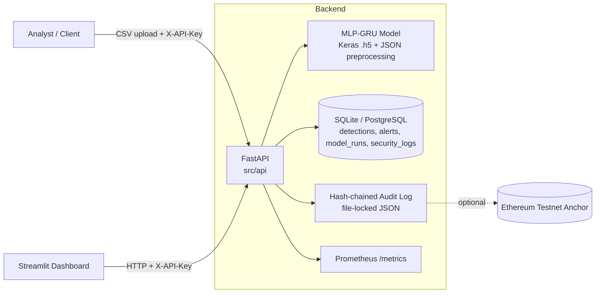

<div align="center">

# 🛡️ SentinelAI

### AI-Powered Network Intrusion Detection System

A hybrid **MLP-GRU** deep-learning detector, served through an authenticated **FastAPI** backend, with a **Streamlit** analyst dashboard and a **tamper-evident audit log**.


</div>

---

## 📖 Table of Contents

1. [Overview](#-overview)
2. [Key Features](#-key-features)
3. [Architecture](#-architecture)
4. [Tech Stack](#-tech-stack)
5. [Project Structure](#-project-structure)
6. [Getting Started](#-getting-started)
7. [Configuration](#-configuration)
8. [Training & Evaluating the Model](#-training--evaluating-the-model)
9. [API Reference](#-api-reference)
10. [Dashboard](#-dashboard)
11. [Security](#-security)
12. [Audit Log](#-audit-log)
13. [Database](#-database)
14. [Monitoring & MLOps](#-monitoring--mlops)
15. [Testing & CI](#-testing--ci)
16. [Model Performance (Honest Results)](#-model-performance-honest-results)
17. [Known Limitations](#-known-limitations)
18. [Contributing](#-contributing)
19. [License](#-license)

---

## 🔎 Overview

**SentinelAI** is an end-to-end network intrusion detection project. It covers the full lifecycle of an ML-based security tool:

| Stage | What SentinelAI does |
|---|---|
| **Data** | Downloads and preprocesses the [NSL-KDD](https://www.unb.ca/cic/datasets/nsl.html) benchmark through an ETL pipeline |
| **Model** | Trains a hybrid **MLP-GRU** neural network to classify traffic as *normal* or *attack* |
| **Serving** | Exposes predictions via a role-protected REST API (upload a CSV, get detections back) |
| **Storage** | Records detections, alerts and training runs in SQLite / PostgreSQL |
| **Integrity** | Keeps a hash-chained audit log, with optional anchoring to a public Ethereum testnet |
| **Visibility** | Provides a password-gated Streamlit dashboard and Prometheus metrics |

> **Design principle: nothing is simulated.** Every number on the dashboard comes from a real API call, and the README reports held-out results rather than only the flattering training-split score (see [Model Performance](#-model-performance-honest-results)).

---

## ✨ Key Features

- 🧠 **Hybrid MLP-GRU detector**: dense layers for feature extraction followed by stacked GRU layers, built in Keras/TensorFlow.
- 🔐 **Secure by default (fail-closed)**: API-key auth with `viewer` / `analyst` / `admin` roles. With no keys configured, protected endpoints return `503`.
- 🧾 **Tamper-evident audit log**: a hash chain with periodic checkpoints that detects tampering *and* truncation.
- ⛓️ **Optional testnet anchoring**: publish the chain head to an Ethereum testnet for an external, independent record.
- 📊 **Analyst dashboard**: Overview, Threat Detection, Model Performance and Audit Log pages.
- 🗄️ **Real persistence**: SQLAlchemy 2 with SQLite by default and PostgreSQL via `DATABASE_URL`.
- 📈 **Observability**: Prometheus metrics for requests, latency, threats, auth failures and rate-limit hits.
- ♻️ **Drift monitoring**: `AutoRetrainer` compares the live model with its training baseline and reports `needs_retraining`.
- 🛡️ **Safe model artifacts**: preprocessing is stored as JSON, not pickle, so a malicious artifact cannot execute code on load.
- 🐳 **One-command deployment**: Docker Compose with non-root containers, health checks and an optional PostgreSQL profile.
- ✅ **70 automated tests** plus a CI pipeline that lints, tests, builds the image and smoke-tests the running container.

---

## 🏗️ Architecture



**Request flow for a prediction**

1. Client uploads a CSV to `POST /api/v1/predict` with an `X-API-Key`.
2. API checks the key and role, applies rate limiting, and validates the upload (size, rows, columns, numeric and finite values).
3. Features are scaled using the saved preprocessing state and passed to the MLP-GRU model.
4. Detections and alerts are written to the database and the event is appended to the audit chain.
5. Results are returned to the client, and Prometheus counters are updated.

The dashboard is a **thin client**. It never touches the database, model files or audit log directly. Everything it displays came back from an API call.

---

## 🧰 Tech Stack

| Layer | Technologies |
|---|---|
| Language | Python 3.12 |
| ML / DL | TensorFlow (Keras), scikit-learn, pandas, NumPy |
| API | FastAPI, Uvicorn, Pydantic |
| Dashboard | Streamlit, Plotly |
| Database | SQLAlchemy 2, SQLite, PostgreSQL |
| MLOps | MLflow (optional model registry), APScheduler |
| Audit / Blockchain | Hash chain (`fcntl` file locking), web3.py (optional anchoring) |
| Monitoring | prometheus-client, python-json-logger |
| DevOps | Docker, Docker Compose, GitHub Actions, pytest, Ruff |

---

## 📁 Project Structure

```text
SentinelAI/
├── config/
│   ├── config.yaml              # Model, ETL, MLOps and retraining settings
│   └── .env.example             # Environment variable template
├── docs/
│   ├── architecture.md          # Extended architecture notes
│   ├── implementation.md        # Implementation details
│   └── QUICKSTART.md            # Legacy quick-start (see note in Contributing)
├── scripts/
│   ├── init_database.py         # Create data dirs + DB schema (idempotent)
│   ├── download_datasets.py     # Fetch NSL-KDD
│   ├── train_model.py           # Train and write data/models/latest.json
│   ├── evaluate_model.py        # Score on official held-out KDDTest+
│   └── migrate_model_artifacts.py  # Convert legacy .pkl artifacts to JSON
├── src/
│   ├── api/                     # FastAPI app + Prometheus metrics
│   ├── blockchain/              # Audit hash chain + testnet anchoring
│   ├── dashboard/               # Streamlit app, auth, API client
│   ├── db/                      # SQLAlchemy models, repository, sessions
│   ├── etl/                     # Extract / transform / load pipeline
│   ├── evaluation/              # NSL-KDD held-out evaluation
│   ├── mlops/                   # Model registry, drift monitoring, retrainer
│   ├── models/                  # MLP-GRU threat detector
│   ├── security/                # API-key auth, rate limiting
│   └── utils/                   # Config loader, logger
├── tests/                       # 70 tests
├── .github/workflows/ci.yml     # CI pipeline
├── Dockerfile
├── docker-compose.yml
├── requirements.txt
└── LICENSE
```

> `data/` (raw data, processed data, trained models, audit chain, database) is created at runtime and is git-ignored.

---

## 🚀 Getting Started

### Prerequisites

- **Python 3.12** (for local setup) *or* **Docker + Docker Compose**
- ~10 GB free disk space and 8 GB RAM (16 GB recommended for training)
- Git

### Option A: Docker (recommended)

```bash
# 1. Clone
git clone https://github.com/shivamchoubey24/SentinelAI-AI-Powered-Network-Intrusion-Detection-System.git
cd SentinelAI-AI-Powered-Network-Intrusion-Detection-System

# 2. Configure
cp config/.env.example config/.env
```

Edit `config/.env` and set **at least** these three values:

```env
SENTINEL_API_KEYS=dashboard:<generated-key>:analyst,admin:<generated-key>:admin
DASHBOARD_PASSWORD=<choose-a-strong-password>
SENTINEL_DASHBOARD_API_KEY=<same key as the "dashboard" entry above>
```

Generate a key with:

```bash
python -c "import secrets; print(secrets.token_urlsafe(32))"
```

```bash
# 3. Start the stack
docker compose up --build
```

| Service | URL |
|---|---|
| API + interactive docs | http://localhost:8000/docs |
| Dashboard | http://localhost:8501 |

```bash
# 4. Download data and train a model inside the stack
docker compose run --rm api python scripts/download_datasets.py
docker compose run --rm api python scripts/train_model.py
docker compose run --rm api python scripts/evaluate_model.py
```

> ⚠️ **No model exists on first launch.** `POST /api/v1/predict` returns `503` until you train one (step 4).

Want PostgreSQL instead of SQLite?

```bash
POSTGRES_PASSWORD=<password> docker compose --profile postgres up --build
# and set DATABASE_URL=postgresql+psycopg2://sentinel:<password>@postgres:5432/sentinel in config/.env
```

### Option B: Local (without Docker)

```bash
python -m venv venv
source venv/bin/activate            # Windows: venv\Scripts\activate
pip install -r requirements.txt     # tip: use tensorflow-cpu for a lighter install

cp config/.env.example config/.env  # edit as described above
export $(grep -v '^#' config/.env | xargs)   # or use python-dotenv / direnv

python scripts/init_database.py     # create data dirs + DB schema
python scripts/download_datasets.py # fetch NSL-KDD
python scripts/train_model.py       # train, writes data/models/latest.json
python scripts/evaluate_model.py    # held-out evaluation

python -m src.api.main                       # API on :8000
streamlit run src/dashboard/app_simple.py    # Dashboard on :8501 (separate terminal)
```

### First request

```bash
curl http://localhost:8000/health

curl -H "X-API-Key: <your-key>" http://localhost:8000/api/v1/status

curl -X POST http://localhost:8000/api/v1/predict \
     -H "X-API-Key: <analyst-or-admin-key>" \
     -F "file=@my_features.csv"
```

---

## ⚙️ Configuration

All runtime settings are environment variables loaded from `config/.env`. Model and retraining settings live in `config/config.yaml`.

### Essential variables

| Variable | Required | Default | Description |
|---|:---:|---|---|
| `SENTINEL_API_KEYS` | ✅ | *(empty, fail-closed)* | Comma-separated `name:key:role` entries. Roles: `viewer`, `analyst`, `admin` |
| `DASHBOARD_PASSWORD` | ✅ | *(none)* | Dashboard login password. If unset, login refuses everyone |
| `SENTINEL_DASHBOARD_API_KEY` | ✅ | *(none)* | API key the dashboard uses. Needs the `analyst` role |
| `SENTINEL_API_URL` | – | `http://127.0.0.1:8000` | Where the dashboard finds the API (Compose sets `http://api:8000`) |
| `DATABASE_URL` | – | `sqlite:///data/sentinel.db` | Any SQLAlchemy URL, including PostgreSQL |
| `CORS_ORIGINS` | – | `http://localhost:8501` | Allowed browser origins. A wildcard is never honored |
| `RATE_LIMIT_PER_MINUTE` | – | `100` | Per-process rate limit |
| `MAX_UPLOAD_BYTES` | – | `10485760` (10 MB) | Maximum upload size |
| `MAX_BATCH_ROWS` | – | `10000` | Maximum rows per prediction request |
| `METRICS_PUBLIC` | – | `false` | Expose `/metrics` without a key (keep the port private) |

### Optional / development-only variables

| Variable | Description |
|---|---|
| `SENTINEL_AUTH_DISABLED=true` | Disables API auth. **Local development only** |
| `DASHBOARD_AUTH_DISABLED=true` | Skips dashboard login. **Local development only** |
| `SENTINEL_ALLOW_LEGACY_PICKLE=true` | Allows loading old `.pkl` artifacts. Prefer running the migration script |
| `ANCHOR_RPC_URL` | RPC endpoint of an Ethereum **testnet** provider |
| `ANCHOR_PRIVATE_KEY` | Funded **testnet** account key (never use a mainnet key) |
| `ANCHOR_ALLOW_MAINNET=true` | Permit mainnet anchoring (costs real money, off by default) |

### Model settings (`config/config.yaml`)

| Setting | Value |
|---|---|
| Architecture | MLP-GRU |
| Hidden (MLP) layers | `[128, 64, 32]` |
| GRU units | `64` (second GRU layer uses half) |
| Dropout | `0.3` |
| Optimizer / LR | Adam / `0.001` |
| Batch size / Epochs | `256` / `50` (early stopping, patience 10) |
| Drift threshold | `0.1` |
| Performance floor | `0.85` |

---

## 🧪 Training & Evaluating the Model

### 1. Train

```bash
python scripts/train_model.py
# optional: --data path/to/processed.csv
```

Trains on `data/processed/nsl_kdd_processed.csv` (NSL-KDD `KDDTrain+_20Percent`, one-hot encoded, random 20% held out) and writes:

| Artifact | Purpose |
|---|---|
| `data/models/<timestamp>_model.h5` | Keras model |
| `data/models/<timestamp>_preproc.json` | Fitted `StandardScaler` and `LabelEncoder` state, plus a SHA-256 of the model file |
| `data/models/latest.json` | Pointer to the newest model and its metrics, read by the API and dashboard |

### 2. Evaluate on the official held-out set

```bash
python scripts/evaluate_model.py
```

This scores the model on NSL-KDD's official **`KDDTest+`** file (which contains attack types never seen in training) and writes `data/models/latest_eval.json`. The result is served at `GET /api/v1/metrics/held-out` and shown on the dashboard.

> ⚠️ **Training-split metrics are optimistic.** They come from a random split of the same file the model trained on. Use the held-out number as your realistic estimate.

### 3. Migrating legacy artifacts

Older versions pickled the scaler and label encoder. Unpickling can execute arbitrary code, so artifacts are now plain JSON.

```bash
python scripts/migrate_model_artifacts.py            # convert, keep .pkl files
python scripts/migrate_model_artifacts.py --delete   # convert, then remove .pkl
```

---

## 🔌 API Reference

Interactive Swagger docs are available at **`/docs`** once the server is running. Every endpoint except `/health` requires an `X-API-Key` header. Roles are cumulative (`admin` ⊃ `analyst` ⊃ `viewer`).

| Method | Endpoint | Role | Description |
|---|---|---|---|
| `GET` | `/health` | none | Liveness / readiness probe |
| `GET` | `/api/v1/status` | viewer | System, model and audit-chain status |
| `GET` | `/api/v1/summary` | viewer | Aggregate counts (detections, threats, alerts) |
| `GET` | `/api/v1/threats?limit=` | viewer | Recent alerts |
| `GET` | `/api/v1/metrics` | viewer | Training-split model metrics |
| `GET` | `/api/v1/metrics/held-out` | viewer | Held-out `KDDTest+` evaluation |
| `POST` | `/api/v1/predict` | analyst | Run the model on an uploaded CSV |
| `GET` | `/api/v1/audit/verify` | viewer | Verify audit chain and checkpoints |
| `GET` | `/api/v1/audit/blocks?limit=` | viewer | Recent audit entries |
| `POST` | `/api/v1/audit/checkpoint` | admin | Record a local checkpoint |
| `POST` | `/api/v1/audit/anchor` | admin | Anchor the chain head on a public testnet (opt-in) |
| `GET` | `/api/v1/audit/anchors?verify=true` | viewer | List and verify testnet anchors |
| `GET` | `/metrics` | viewer* | Prometheus metrics (*public if `METRICS_PUBLIC=true`) |

### Input format for `/api/v1/predict`

- A CSV of **preprocessed numeric feature rows**, with the same columns the model was trained on.
- A trailing `label` / `class` column is dropped automatically if present.
- Uploads are bounded by `MAX_UPLOAD_BYTES`, `MAX_BATCH_ROWS` and a column-count limit.
- Non-numeric or non-finite values are rejected before reaching the model.

---

## 📊 Dashboard

```bash
streamlit run src/dashboard/app_simple.py
```

| Page | What it shows |
|---|---|
| **Overview** | Aggregate detections, threats and alerts |
| **Threat Detection** | Upload a CSV and view the model's detections |
| **Model Performance** | Training-split metrics, confusion matrix and the **held-out KDDTest+ result** |
| **Audit Log** | Recent audit blocks and chain verification status |

- Password-gated via `DASHBOARD_PASSWORD`, with per-session backoff on failed logins.
- Every figure is fetched from the API at render time. There are no demo or random numbers, and `tests/test_dashboard.py` checks this directly.
- `src/dashboard/app.py` is kept as a compatibility shim for `app_simple.py`.

---

## 🔒 Security

| Area | Implementation |
|---|---|
| **Authentication** | API keys, compared with `hmac.compare_digest` against SHA-256 digests (no plaintext comparison) |
| **Authorization** | Role hierarchy `viewer < analyst < admin` |
| **Fail-closed** | No keys configured means `503` on every protected route |
| **CORS** | Explicit origins only; wildcard is never honored |
| **Rate limiting** | Per API key (or client IP), set by `RATE_LIMIT_PER_MINUTE` |
| **Input validation** | Size, row and column limits; numeric and finite values only |
| **Model artifacts** | JSON instead of pickle, with a SHA-256 integrity check on load |
| **Containers** | Run as an unprivileged user (UID 10001) with health checks |
| **Legacy pickle** | Only read through a restricted unpickler that accepts a single expected class |

> Found a vulnerability? Please report it privately to the maintainer rather than opening a public issue.

---

## 🧾 Audit Log

`src/blockchain/blockchain_logger.py` is an honestly-named **single-node, hash-chained log**. It is not a distributed ledger.

- Each entry includes the previous entry's hash.
- `GET /api/v1/audit/verify` re-walks the whole chain and cross-checks it against periodic checkpoints in `checkpoints.jsonl`, catching both **tampering** and **truncation**.
- Writes are file-locked (`fcntl`) and atomic, so multiple workers cannot corrupt the chain.
- A legacy `.pkl` chain file migrates automatically on first load.

**What local verification cannot catch:** someone with write access to *both* the chain file and `checkpoints.jsonl` can rewrite history consistently.

### Optional: public testnet anchoring

`src/blockchain/anchor.py` publishes `(chain length, head hash)` as a zero-value transaction on an Ethereum **testnet**, creating a record outside the operator's control.

```bash
ANCHOR_RPC_URL=https://<your-testnet-provider-url>
ANCHOR_PRIVATE_KEY=0x...      # funded TESTNET account only
```

Then call `POST /api/v1/audit/anchor` (admin) and verify with `GET /api/v1/audit/anchors?verify=true`.

- Mainnet is refused unless `ANCHOR_ALLOW_MAINNET=true` is set.
- Anchoring proves the head existed by that block and was not rewritten. It does **not** prove entries were truthful when written.
- Tested against an in-memory Ethereum chain (`tests/test_anchor.py`) and never run against a live testnet by this project.

---

## 🗄️ Database

SQLAlchemy 2 with **SQLite** by default (`data/sentinel.db`) and **PostgreSQL** via `DATABASE_URL`.

| Table | Contents |
|---|---|
| `security_logs` | Ingested log / traffic records from the ETL pipeline |
| `model_runs` | Training runs with metrics and artifact paths |
| `detections` | Per-record prediction results |
| `alerts` | Threat alerts with severity |

`scripts/init_database.py` is idempotent and safe to run repeatedly.

---

## 📈 Monitoring & MLOps

**Prometheus** (`GET /metrics`) exposes request counts and latency by route, records analyzed, threats detected, auth failures by reason, rate-limit rejections, and model-loaded and audit-chain-valid gauges. Private by default (needs a `viewer` key).

**Drift monitoring**: `AutoRetrainer.run_monitoring_cycle()` (`src/mlops/auto_retrainer.py`) evaluates the latest model on a fresh labeled CSV, compares it with the training baseline in `latest.json`, and reports performance drift and a minimum-performance floor. It **does not retrain automatically**; it reports `needs_retraining` for the caller to act on.

**Model registry**: `ModelRegistry` is MLflow-backed and degrades gracefully (logs a warning) when no MLflow server is reachable.

---

## ✅ Testing & CI

```bash
pytest -q                                      # full suite (70 tests)
pytest -q -k "not tensorflow"                  # skip TensorFlow-dependent tests
pytest -q --cov=src --cov-report=term-missing  # with coverage
ruff check src scripts tests --select E9,F     # lint
```

Tests cover the database layer, the audit chain (including simulated history-rewrite and truncation attacks), API auth / CORS / validation / rate limiting, model artifact save / load / tamper detection, the monitoring cycle, testnet anchoring, held-out evaluation, and the dashboard. Tests that need TensorFlow or web3 skip cleanly when those packages are absent.

**GitHub Actions** (`.github/workflows/ci.yml`) runs on every push to `main` and every pull request: lint, tests with coverage, `docker-compose.yml` validation, Docker image build, and a smoke test of the running container (`/health`, an unauthenticated `401`, and an authenticated request).

---

## 🎯 Model Performance (Honest Results)

The reference model reports **99.2% accuracy** on its training-split test set, but that figure is optimistic. On NSL-KDD's official held-out sets:

| Metric | Training split | Held-out `KDDTest+` | Harder `KDDTest-21` |
|---|---:|---:|---:|
| Accuracy | 99.2% | **78.3%** | **58.9%** |
| Precision | 99.2% | 93.4% | n/a |
| Recall | 99.0% | 66.7% | 55.9% |
| False-positive rate | n/a | 6.2% | n/a |

**Detection rate by attack family (held-out):**

| Family | Detection rate |
|---|---:|
| DoS | 84.7% |
| Probe | 82.1% |
| R2L | **8.5%** |
| U2R | **10.4%** |

Attack types present in `KDDTest+` but **absent from training** (3,752 records, e.g. `mailbomb`, `processtable`, `snmpguess`, `snmpgetattack`, `httptunnel`) are detected only **43.1%** of the time.

**How to read this:** the model is reasonably effective against DoS and Probe traffic similar to what it trained on, and unreliable against R2L/U2R attacks and previously unseen attack types. That unseen-attack regime is where a production IDS matters most, so **do not quote 99% as expected real-world performance.**

> These figures are from the author's reference run. Your numbers will differ slightly after retraining. Run `python scripts/evaluate_model.py` to reproduce.

---

## ⚠️ Known Limitations

- **Dataset age**: NSL-KDD dates from 2009. Even held-out performance does not guarantee results on modern, real traffic.
- **Audit log**: single node with no consensus or peers (see [Audit Log](#-audit-log)).
- **Rate limiting**: per-process, so it multiplies across workers or replicas rather than being shared.
- **Model integrity**: the SHA-256 check catches accidental or in-place edits, but not a fully replaced model file together with a regenerated hash.
- **Dashboard auth**: a single shared password, suitable for small teams. Use a reverse proxy or SSO for larger deployments.
- **MLflow registry**: needs a running MLflow server; without one, registry features are inert (training, prediction and monitoring do not depend on it).
- **Input format**: `/predict` expects already-preprocessed numeric features, not raw packet captures.

---

## 🤝 Contributing

Contributions are welcome!

1. Fork the repository and create a branch: `git checkout -b feature/my-feature`
2. Make your changes and add tests
3. Run `ruff check src scripts tests --select E9,F` and `pytest -q`
4. Commit with a clear message and open a Pull Request

Please keep PRs focused, and update this README when behavior or configuration changes.

> 📝 **Docs note:** `docs/QUICKSTART.md` and parts of `config/config.yaml` / `.env.example` (Gemini, AWS, Kafka, MongoDB) reflect an earlier version of the project. This README is the up-to-date reference.

---

## 📄 License

Distributed under the **MIT License**. See [`LICENSE`](LICENSE) for details.

## 👤 Author

**Shivam Choubey** ([@shivamchoubey24](https://github.com/shivamchoubey24))

---

<div align="center">

⭐ If you find this project useful, consider giving it a star!

</div>
